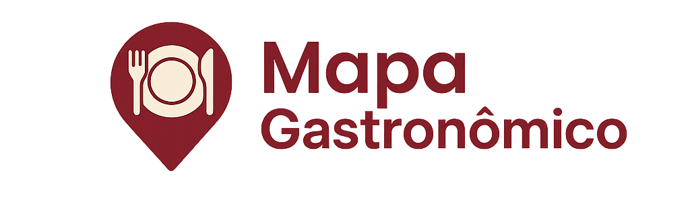

<div class="banner" align="center">
    
</div><br>

# Mapa Gastronômico

App mobile desenvolvido com **Ionic + Angular**, que permite registrar e avaliar locais gastronômicos (restaurante, bar, café etc.) em um mapa interativo, funcionando como um diário pessoal offline. <br>
Projeto acadêmico simples apresentado para avaliação da matéria de Desenolvimento Mobile da faculdade, focado em aplicar conceitos estudados sobre mapas interativos, geolocalização e armazenamento local.

## Screenshots

<div align="center">
    
    
    
    
</div>

## Funcionalidades

- Adicionar marcadores personalizados no mapa usando geolocalização atual do usuário
- Registrar nome, categoria, nota, observações e data da visita
- Filtrar locais salvos por nome, categoria e nota mínima
- Busca reativa: resultados dos locais salvos atualizam enquanto digita
- Armazenamento local com Ionic Storage (sem conexão com a internet)

## Tecnologias

- Ionic Framework (Angular)
- Capacitor (Geolocation)
- Ionic Storage (persistência local)

## Como rodar o projeto

### Pré-requisitos:

Antes de iniciar o projeto, é necessário ter instalado:

#### Node.js ([https://nodejs.org/en/download](https://nodejs.org/en/download))

#### Ionic CLI

```
npm install -g @ionic/cli
```

#### Capacitor CLI (opcional, geralmente já vem incluso no Ionic)

```
npm install -g @capacitor/cli
```

#### Cordova

```
npm install -g cordova
```

### Primeiros passos

Clonar este repositório

```bash
git clone https://github.com/gabscardoso-s/mapa-gastronomico mapa-gastronomico

cd mapa-gastronomico
```

#### Instalando dependências NPM

```
npm install
```

#### Rodar no navegador

```
ionic serve
```

#### Rodar em Android (ambiente já configurado para android)

Instale o **Android Studio** -> [Download](https://developer.android.com/studio) <br>
Na pasta do projeto:

```
ionic capacitor run android
```

#### Rodar em iOS

Instale o **Xcode** -> [Download](https://developer.apple.com/xcode/) <br>
Cria a pasta do iOS:

```
npx cap add ios
```

Execute:

```
ionic capacitor run ios
```

## Licença

Sob Licença MIT, leia o texto completo aqui: [LICENSE MIT](https://github.com/gabscardoso-s/mapa-gastronomico/blob/main/LICENSE)
